# TryHackMe Writeup: OWASP Top 10 2025 Application Design Flaws by Samuel
ID: CTC-116-26

This is my writeup for the TryHackMe room **OWASP Top 10 2025: Application Design Flaws**.
Room Link: [https://tryhackme.com/room/owasptopten2025two](https://tryhackme.com/room/owasptopten2025two)

In this writeup, I documented all the steps I took and the tasks I completed during the lab.
I worked on it in multiple days and the ip address for the lab machine is not same for each task.

---

## Lab Setup and OpenVPN Connection

First, I downloaded my VPN configuration file from TryHackMe and connected to the network using OpenVPN in my terminal. I verified that my connection was active and that I received an IP address on the VPN network.

I used `Sudo openvpn eu-west-1-samuelnaod3-regular-tcp.ovpn`

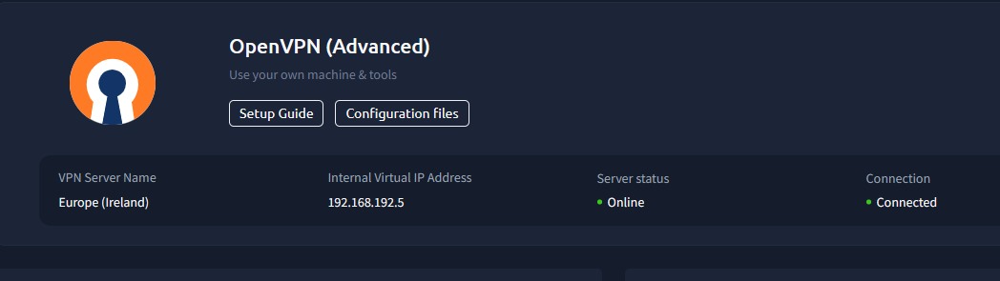

---

## Task 1: AS02 - Security Misconfigurations

In this task, I worked on exploiting verbose error messages and security misconfigurations in a User Management API.

1. I opened my web browser and navigated to `http://10.82.148.45:5002`.
2. I saw the User Management API documentation page which explained how to use the `GET /api/user/<user_id>` endpoint. The documentation noted that the user ID must be numeric.

   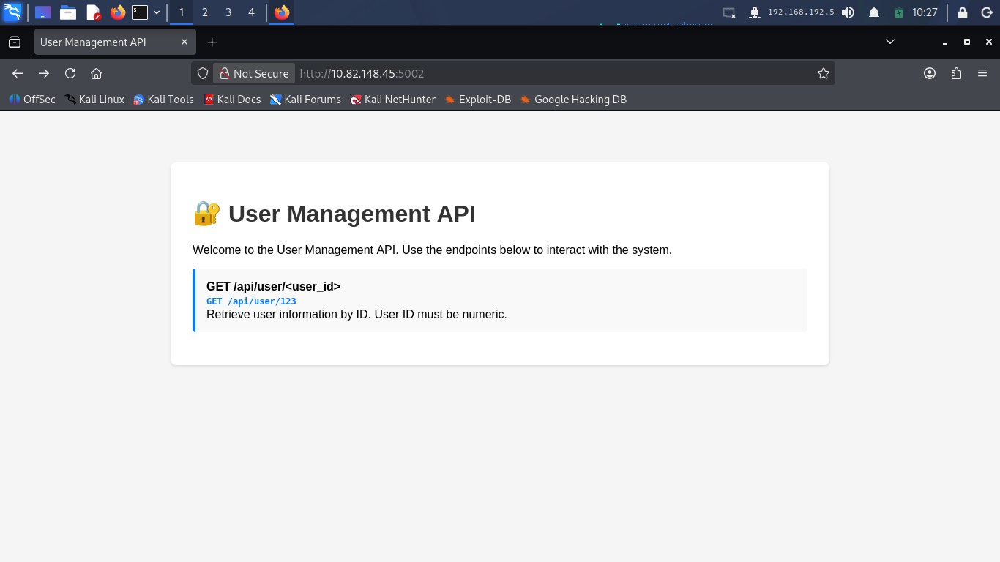

3. I wanted to see how the server responds when invalid input is provided. I tried entering a non-numeric string `s` instead of a number by visiting `http://10.82.148.45:5002/api/user/s`.
4. The server returned a verbose JSON error response with debug information and a full Python stack traceback. The debug output leaked the flag directly: `THM{V3RB0S3_3RR0R_L34K}`.

   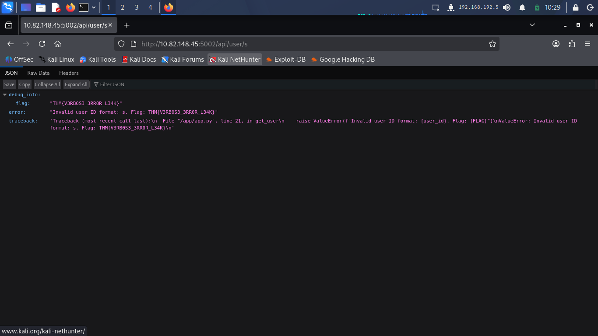

5. Checked the flag on tryhackme.

   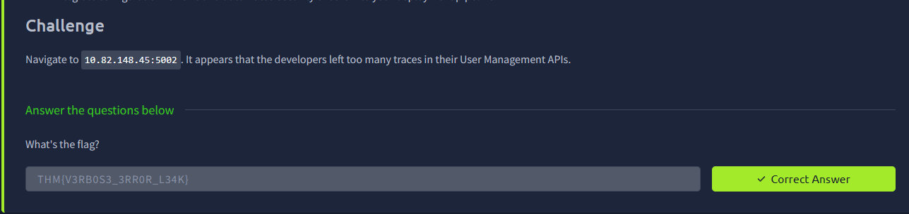

---

## Task 2: AS03 - Software Supply Chain Failures

In this task, I investigated a Data Processing Service API to find hidden debug parameters and supply chain flaws.

1. I first navigated to `http://10.82.161.13:5003` in my browser. I examined the API documentation page which listed the available endpoints `POST /api/process` and `GET /api/health`.

   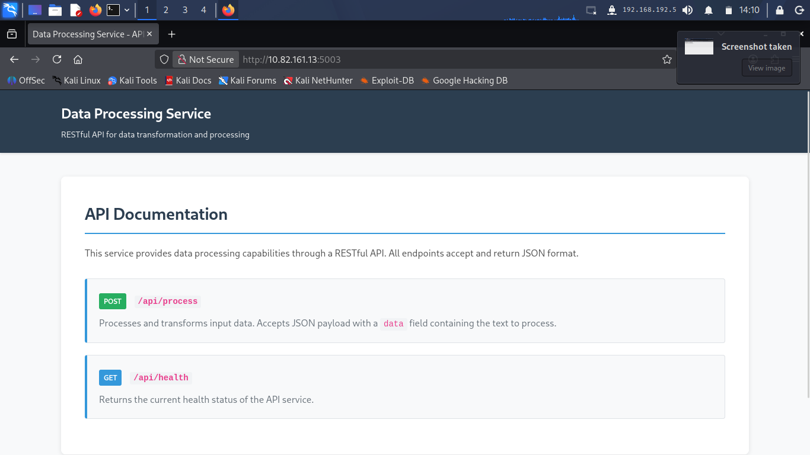

2. By reviewing the source code snippet provided in the TryHackMe task question, I discovered the following check in the backend handler:
   ```python
   # Check for debug mode
   if data == 'debug':
       return jsonify(debug_info())
   ```
   The `"data": "debug"` in the JSON body would trigger the application to expose sensitive internal debug information.

   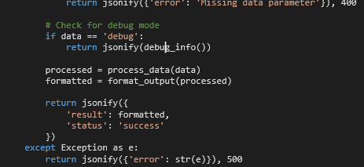

3. I opened my terminal to test the API with `curl`, sending a POST request to `http://10.82.161.13:5003/api/process` with a JSON payload of `{"data":"debug"}`:

   ```bash
   curl -X POST http://10.82.161.13:5003/api/process -H "Content-Type: Application/json" -d '{"data":"debug"}'
   ```

4. The server processed my debug request and returned internal configuration tokens along with the flag: `THM{SUPPLY_CH41N_VULN3R4B1L1TY}`.

   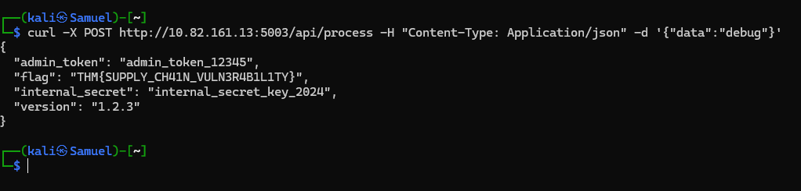

5. Checked the flag `THM{SUPPLY_CH41N_VULN3R4B1L1TY}` into TryHackMe and completed the task.

   

---

## Task 3: AS04 - Cryptographic Failures

In this task, I analyzed a Secure Document Viewer web application that used weak cryptographic implementation and hardcoded secrets.

1. I first visited `http://10.82.161.13:5004` in my browser. The web page displayed an encrypted document payload.

   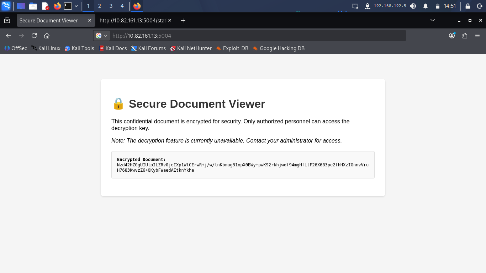

2. I wanted to see how the client application handles decryption. I inspected the source files of the page and found a JavaScript file at `http://10.82.161.13:5004/static/js/decrypt.js`.
3. I opened `decrypt.js` in my browser view-source mode. I found hardcoded encryption variables inside the code:
   - `SECRET_KEY = "my-secret-key-16"`
   - `ENCRYPTION_MODE = "ECB"`

   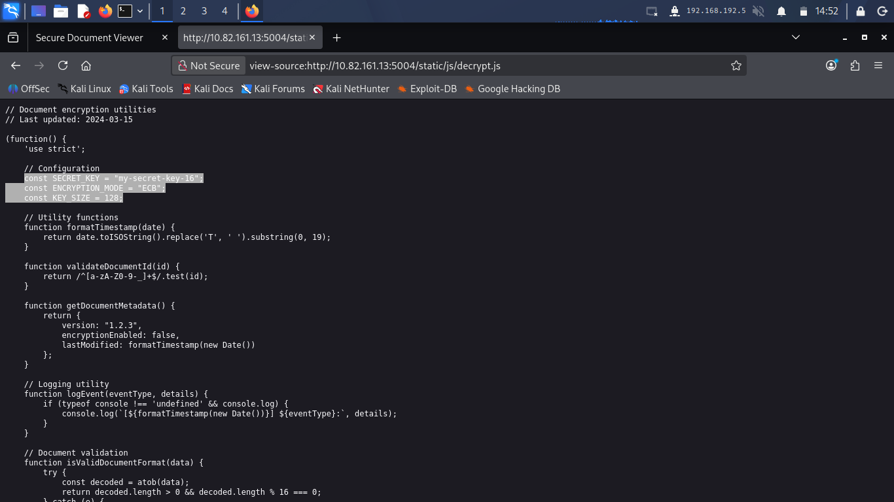

4. I copied the encrypted text string from the web page and opened CyberChef in my browser.
5. I set up CyberChef with two steps:
   - **From Base64**
   - **AES Decrypt** with Key `my-secret-key-16` and Mode `ECB`.
6. CyberChef decrypted the data and revealed the plain text content along with the flag: `THM{CRYPTO_FAILURE_H4RDCOD3D_K3Y}`.

   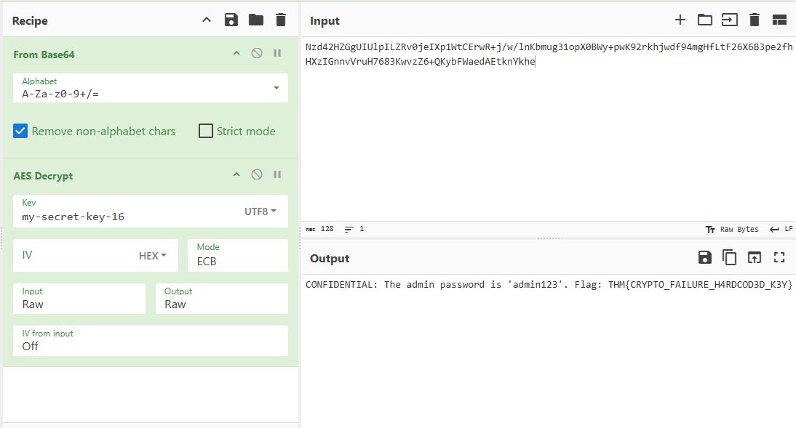

7. I submitted `THM{CRYPTO_FAILURE_H4RDCOD3D_K3Y}` on TryHackMe and verified it was correct.

   

---

## Task 4: AS05 - Insecure Design

In this task, I analyzed a SecureChat application to discover unauthenticated endpoints and insecure design assumptions.

1. I navigated to `http://10.80.148.50:5005` in my browser. The main page said that SecureChat was designed exclusively for mobile devices and prompted me to download the mobile app.

   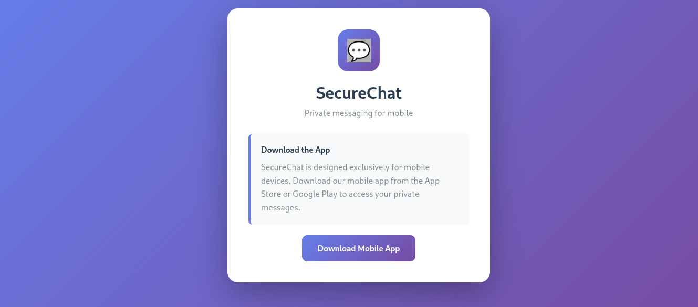

2. I opened Burp Suite to intercept the web traffic from my browser to see what requests were being sent.

   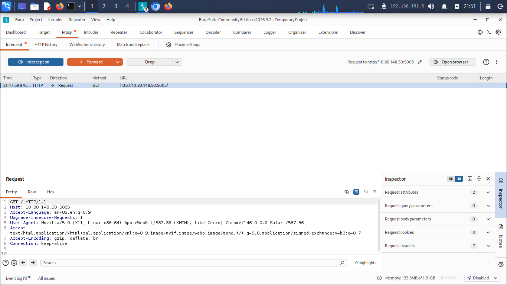

3. I captured the GET request in Burp Suite Proxy and sent it to Burp Intruder to test for hidden API endpoints.

   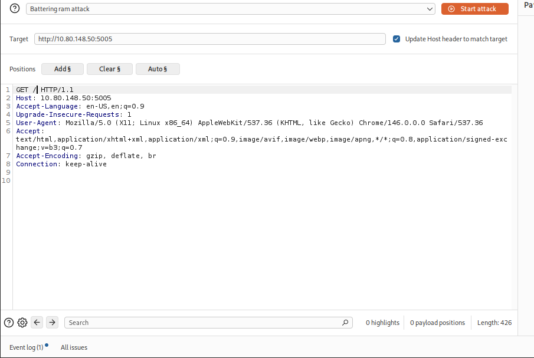

   I configured the payload position in Burp Intruder by adding the `§fuzz§` marker in the API path (`GET /api/§fuzz§/admin`).

   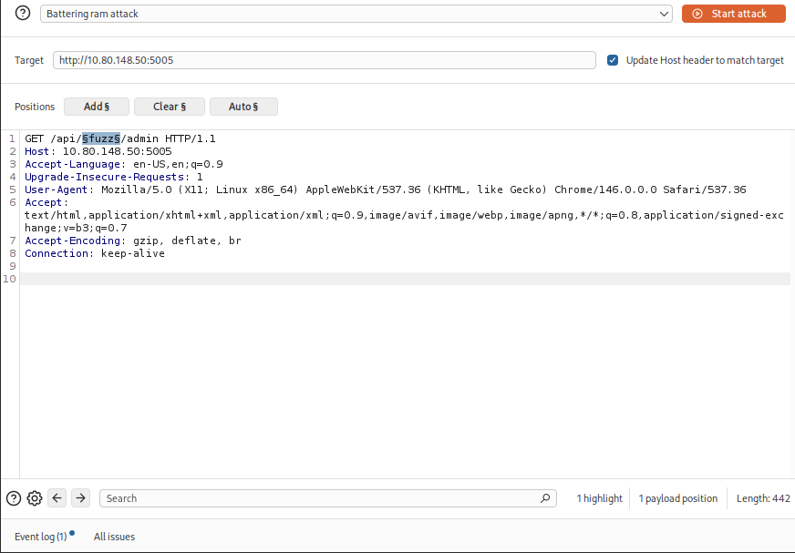

4. I ran an Intruder attack against the API path endpoints. When testing the payload `messages`, the request to `GET /api/messages/admin` returned an HTTP 200 OK status code.
5. In the HTTP response body, the API returned system messages containing the flag: `THM{1NS3CUR3_D3S1GN_4SSUMP T10N}`.

   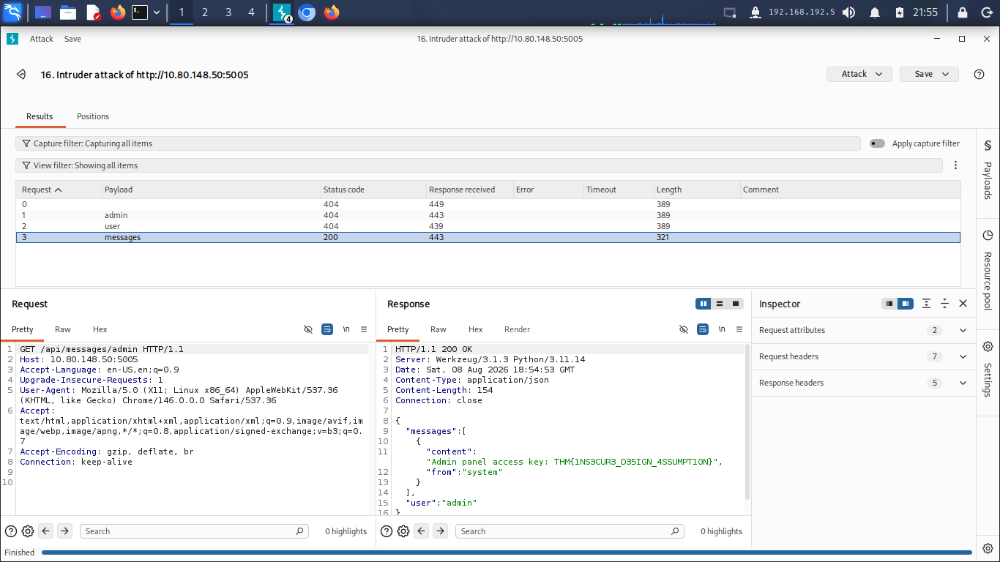

6. checked the flag `THM{1NS3CUR3_D3S1GN_4SSUMP T10N}` and it's correct.

   

---

## Lab Conclusion

I completed all the practical tasks in this room. The last one was a bit tricky.
I tried using Burp Suite to identify the unprotected routes, and it finally worked after testing my patience.
I used 'wordlists' for the payload and added the words I expected to find. Finally, I got it. Trying Burp Suite was one of the lessons for me also I learned how security design failures like verbose error leaks,
exposed debug modes, hardcoded crypto keys, and missing access controls on API endpoints can compromise application security.

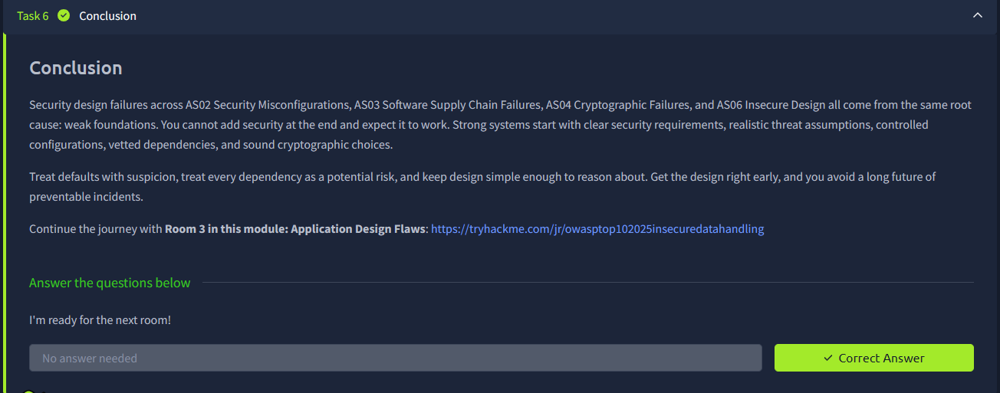
